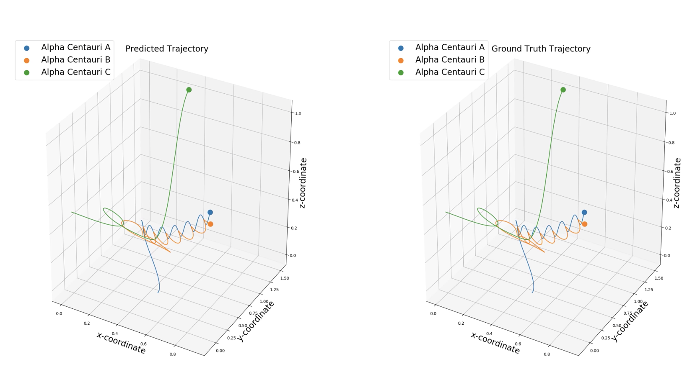
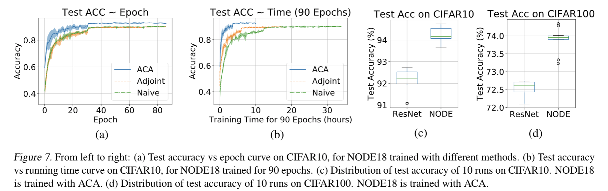

# PyTorch implementation of "Adaptive Checkpoint Adjoint" (ACA) for an accurate and differentiable ODE solver
- This library provides ordinary differential equation (ODE) solvers implemented in PyTorch. <br/>
- Compared with ```torchdiffeq``` implementation, ACA uses a trajectory checkpoint strategy to guarantee numerical accuracy in reverse-mode trajectory, hence is more accurate in gradient estimation. <br/>
- To our knowledge, ACA is the first adaptive solver to enable Neural-ODE model to outperform a ResNet model on benchmark such as Cifar classification, which also supports adaptive-stepsize and error estimation as most widely used softwares. <br/>
- ACA supports conventional parametric ODE models. <br/>
- ACA is written in PyTorch, hence supports automatic differentiation, and can be plugged into exisiting neural network models. Furthermore, with ACA, we can build ODE models, and efficiently estimate the unkown parameters inside the model using optimizers provided by PyTorch.
- ACA supports higher order derivative (e.g. add gradient penalty to the loss function).

## Dependencies
- PyTorch 1.0 (Will test on other versions later)
- tensorboardX
- Pythorn 3

## How to use
```
options = {}
options.update({'method':args.method})
options.update({'h': args.h})
options.update({'t0': args.t0})
options.update({'t1': args.t1})
options.update({'rtol': args.rtol})
options.update({'atol': args.atol})
options.update({'print_neval': args.print_neval})
options.update({'neval_max': args.neval_max})

out = odesolve(odefunc, x, options)
```
### parameters
See https://github.com/juntang-zhuang/torch_ACA/blob/master/torch_ACA/odesolver/adaptive_grid_solver.py for a full list of parameters
- method: which ode solver. Fixed stepsize solvers include ['Euler','RK2','RK4'], adaptive stepsize solvers include ['RK12','RK23','RK45','Dopri5']
- h: initial stepsize. h must be specified for fixed stepsize solvers, and can be set as None (or not parsed) for adaptive solvers.
- t0, t1: start and end time. t1 can be either smaller or larger than t0.
- rtol, atol: relative and absolute error tolerance for adaptive solvers. 
- print_neval: bool type, print number of evaluations of the function.
- neval_max: the maximum number of function evaluation, typically set as a large number (e.g. 500,000). If this number is reached, the ODE is stiff.

### Train with different modes
#### End-time fast mode <br/>
```cifar_classification/train.py``` uses the solver defined in ```torch_ACA/odesolver_mem/ode_solver_endtime.py```, this mode only support integration from start time t0 to end time t1, and output a tensor for time t1.
```
from torch_ACA import odesolve_endtime as odesolve
out = odesolve(odefunc, x, options)
```

#### End-time memory-efficient mode <br/>
```cifar_classification/train_mem.py``` uses the solver defined in ```torch_ACA/odesolver_mem/adjoint_mem.py```, this mode only support integration from start time t0 to end time t1, and output a tensor for time t1. Furtheremore, this mode uses O(Nf + Nt) memory, which is more memory-efficient than normal mode, but the running time is longer.
```
from torch_ACA import odesolve_adjoint as odesolve
out = odesolve(odefunc, x, options)
```

#### Multiple evaluation time-points mode <br/>
```cifar_classification/train_multieval.py``` uses the solver defined in ```torch_ACA/odesolver/ode_solver.py```, this mode supports extracting outputs from multiple time points between t0 and t1. 
```
## Case1: t_eval contains one evaluation time points
from torch_ACA import odesolve
options.update({'t_eval': [args.t1]})
out = odesolve(odefunc, x, options)
out = out[0,...]

## Case2:  t_eval contains multiple time points
from torch_ACA import odesolve
options.update({'t_eval': [a1, a2, a3, ... an]})
out = odesolve(odefunc, x, options)
out1, out2, ... outn = out[0,...], out[1,...], ... out[n-1,...]
```

- Note for multiple evaluation time-points mode: <br/>
```
   (1) Evaluation time 't_eval' must be specified in a list. 
        e.g.  t_eval = [a1, a2, a3 ..., an]  
        where t0 < a1 < a2 < ... t1, or t1 < a1 < a2 < ... < t0 
   (2) Suppose 'z' is of shape 'AxBxCx...', then the output is of shape 'nxAxBxCx...', 
        while in the end-time mode the output is of shape 'AxBxCx...'
   (3) Both multiple time-points mode and end-time fast mode support higher order derivatives 
        (e.g. add gradient penalty in the loss function).
   (4) Adaptive stepsize solver is recommended in multi evaluation time-points mode
```

#### Warning
- This repository currently only supports ``` \frac{dz}{dt} = f(t,z) ``` where ```z``` is a tensor (other data types such as tuple are not supported). <br/>
- If you are using a function ```f``` which produces many output tensors or ```z``` is a list of tensors, you can concatenate them into a single tensor within definition of ```f```.


## Examples
### Three-body problem
Please run ```python three_body_problem.py ```. <br/>
The problem is: given trajectories of three stars, how to estimate their masses and predict their future trajectory.<br/>
[Watch the videos in folder ```figures```](https://www.youtube.com/playlist?list=PL7KkG3n9bER4ODAMzAKzfXIaF0ndUxK-N)
[](https://www.youtube.com/playlist?list=PL7KkG3n9bER4ODAMzAKzfXIaF0ndUxK-N)

### Image classification on Cifar
A ResNet18 is modified into its corresponding ODE model, and achieve ~5% errorate (vs 10% by adjoint method and naive method).
Code is in folder ```cifar_classification```
#### How to train
```
python train.py
```
You can visualize the training and validation curve with 
```
tensorboard --logdir cifar_classification/resnet/resnet_RK12_lr_0.1_h_None
```

### Results


## References
[1] Zhuang, Juntang, et al. "Adaptive Checkpoint Adjoint Method for Gradient Estimation in Neural ODE." arXiv preprint arXiv:2006.02493 (2020). [[arxiv]](https://arxiv.org/abs/2006.02493) <br/>

Please cite our paper if you find this repository useful:
```
@article{zhuang2020adaptive,
  title={Adaptive Checkpoint Adjoint Method for Gradient Estimation in Neural ODE},
  author={Zhuang, Juntang and Dvornek, Nicha and Li, Xiaoxiao and Tatikonda, 
  Sekhar and Papademetris, Xenophon and Duncan, James},
  journal={ICML},
  year={2020}
}
```
